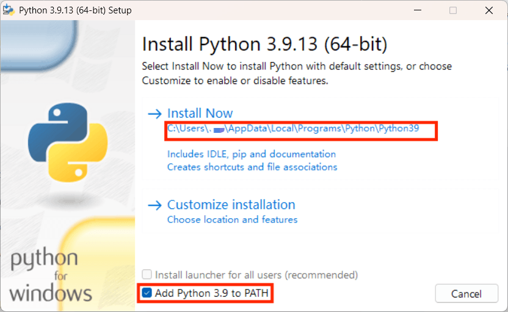

# LZURunningHelper

兰大悦跑模拟

本项目改写自 [PKURunningHelper](https://github.com/RinCloud/PKURunningHelper)，所做的工作仅仅是在这个项目的基础之上修改了地图路径数据，直接适配于 LZU

鉴于本校二手群中有人使用类似项目盈利，打着人工代跑的旗号，实际上利用虚拟定位提供路径严重偏差的低劣服务，因此将这个自己用的小工具开源

~~使用中有问题欢迎提 issue，秒修的 QWQ~~

# 环境配置（已有 Python 3.9 环境可以跳过）

1. 从官网下载 [python 3.9.x](https://www.python.org/ftp/python/3.9.13/python-3.9.13-amd64.exe)

2. 运行安装程序，**请注意这里要勾选选项“Add Python 3.9 to PATH”**，以本机为例：


3. 克隆本仓库：
    ```bash
    git clone https://github.com/TarikVon/LZURunningHelper.git
    ```
    
    然后进入项目目录：
    ```bash
    cd LZURunningHelper
    ```

4. 在项目根目录 (`LZURunningHelper`) 下，按 `Win+R` 输入 `cmd` 打开命令行工具，执行以下命令来创建虚拟环境：
    ```bash
    "%LOCALAPPDATA%\Programs\Python\Python39\python.exe" -m venv .venv
    ```
    > 注意这里的终端要使用 cmd，PowerShell 指令会报错

5. 激活虚拟环境（CMD）：
    ```bash
    .\.venv\Scripts\activate.bat
    ```
6. 安装环境依赖：
    ```bash
    pip install -r requirements.txt
    ```

# 软件使用
1. 编辑项目目录中 `config.ini` 文件，根据里面的注释修改配置：
    ```ini
    # filename: config.ini
    # coding: utf-8
    [Base]
    APP: Joyrun
    debug: true

    # StudentID: 在这里输入你的学号，不用带邮箱后缀，例：1145141919810
    # Password: 密码，默认为 123456
    # suffix: 邮箱后缀，一般不用修改
    # Phone: 手机号（可选），当账号已绑定手机，需要短信验证码时输入
    [Joyrun]
    StudentID: 
    Password: 
    suffix: @lzu.edu.cn
    Phone: 

    # record_type: 选择你想要的跑步路径，可以有以下值：
    # - dongcao: 东操
    # - xicao: 西操
    # - random: 随机
    record_type: random
    record_number: 1

    # distance: 距离，单位 km
    # pace: 每公里多少分钟，一般不用修改
    # stride_frequncy: 步幅，一般不用修改
    distance: 2
    pace: 5.50
    stride_frequncy: 170
    ```
2. 在项目目录下，激活虚拟环境后，运行指令：
    ```bash
    python .\main.py -s
    ```
3. 若看到控制台最后输出以下内容，则代表跑步记录发布成功：
    ```plaintext
    [DEBUG] joyrun, 2025-05-01 02:37:20, response.json = {
        "fid": xxx,
        "postRunId": xxx,
        "ret": "0",
        "msg": "发布成功",
        "sid": "xxx",
        "fraud": "0",
        "lasttime": xxx,
        "weixinurl": "xxx",
        "fraudSubStatus": 0,
        "multipleUpload": false
    ```
4. 此时，打开悦跑圈 APP 确认你的记录。

# 关于自定义跑步路径
跑步路径文件在 `Joyrun/data/` 路径下，格式为
```
[
    [纬度1, 经度1], 
    [纬度2, 经度2],
    ...
    [纬度n, 经度n] 
]
```
悦跑圈底层调用的是高德地图 API，所以需要使用高德地图坐标拾取器获取跑步路径经纬度：
[https://lbs.amap.com/tools/picker](https://lbs.amap.com/tools/picker)

注意高德地图复制的经纬度格式是 `[经度, 纬度]`，如 `[104.162887,35.945782]`，  
而本软件所使用的经纬度格式为 `[纬度, 经度]`，如 `[35945782, 104162887]`，  
需要经纬度互换以及去除小数点（可以编写程序实现修改）。

按顺序点击想要的路径，按路径点顺序复制经纬度（一定要按顺序，比如操场顺时针跑圈上的顺序），如果数据采样点越多，那么跑步路径就越平滑。  
在本软件前期实现中，编写程序对每两个采样点间进行了线性插值操作，可以采用类似的思想来增加数据点让路径更好看一些。